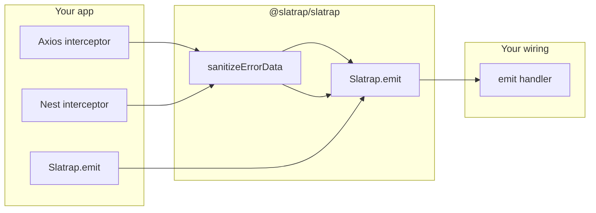

# @slatrap/slatrap

[](https://www.npmjs.com/package/@slatrap/slatrap)

Sanitize and emit fintech provider errors (Plaid, Stripe, and similar) without leaking secrets. Framework-agnostic — use from Node, Axios, or NestJS.

Published on [npm](https://www.npmjs.com/package/@slatrap/slatrap) under the [@slatrap](https://www.npmjs.com/org/slatrap) scope.

## Install

```bash
npm install @slatrap/slatrap
```

For the Nest interceptor, also install peers:

```bash
npm install @nestjs/common rxjs
```

## Quick start

**1. Sanitize a payload**

```ts
import { sanitizeErrorData } from '@slatrap/slatrap';

const safe = sanitizeErrorData({
  access_token: 'secret',
  error_code: 'ITEM_LOGIN_REQUIRED',
  error_type: 'ITEM_ERROR',
});

// access_token → [REDACTED]; whitelisted error fields kept
```

**2. Wire emit once, then call from anywhere**

```ts
import { configureSlatrap, Slatrap } from '@slatrap/slatrap';

configureSlatrap({
  emit: (payload) => {
    // Your logger, queue, or event bus
    console.log('provider error', payload);
  },
});

void Slatrap.emit({
  provider: 'plaid',
  endpoint: '/plaid/transactions/get',
  statusCode: 400,
  providerPayload: {
    error_code: 'ITEM_LOGIN_REQUIRED',
    error_type: 'ITEM_ERROR',
    request_id: 'req_123',
  },
});
```

Until you call `configureSlatrap` (or `Slatrap.configure`), `Slatrap.emit()` is a no-op.

## How it works



## Examples

### Standalone sanitizer

```ts
import { sanitizeErrorData, SENSITIVE_KEY_PATTERNS } from '@slatrap/slatrap';

const safe = sanitizeErrorData(raw, {
  redactionText: '[REDACTED]',
  whitelist: ['customField'],
});
```

### Axios response interceptor

Bring your own `axios` client:

```ts
import axios from 'axios';
import { createAxiosResponseErrorInterceptor } from '@slatrap/slatrap';

const client = axios.create();
client.interceptors.response.use(
  (response) => response,
  createAxiosResponseErrorInterceptor(),
);
```

### NestJS interceptor

```ts
import { Controller, UseInterceptors } from '@nestjs/common';
import { configureSlatrap } from '@slatrap/slatrap';
import { ProviderErrorInterceptor } from '@slatrap/slatrap/nestjs';

configureSlatrap({
  emit: (payload) => myEventBus.publish('provider.error', payload),
});

@Controller('payments')
@UseInterceptors(ProviderErrorInterceptor)
export class PaymentsController {}
```

### Wire to your own event bus

If you use a shared inspector or internal bus (no extra package required):

```ts
import { Slatrap } from '@slatrap/slatrap';

Slatrap.configureForCoreInspector({
  emitter: myEventBus,
  providerErrorEventName: 'provider.error',
  defaultProvider: 'plaid',
});
```

## What gets redacted

By default, keys matching sensitive patterns are replaced with `[REDACTED]`:

- Tokens and secrets: `access_token`, `refresh_token`, `client_secret`, `api_key`, `authorization`, `password`, …
- Account identifiers: patterns for account/card numbers (see `SENSITIVE_KEY_PATTERNS` in the package).

Whitelisted top-level fields (e.g. `provider`, `endpoint`, `statusCode`, `providerPayload`, Plaid `error_code`) are kept. Extend with `whitelist` in `sanitizeErrorData` options.

## Screenshots

Optional demo images (add under `packages/slatrap/docs/` in the repo):

| File | Shows |
|------|--------|
| `docs/sanitize-example.png` | Before/after JSON with `access_token` redacted |
| `docs/emit-handler.png` | Console output from a custom `emit` handler |
| `docs/nest-interceptor.png` | Nest request + emit log line |

Run the quick start sanitize snippet to capture your own before/after example.

## API summary

| Export | Purpose |
|--------|---------|
| `sanitizeErrorData` | Redact sensitive fields on any value |
| `Slatrap.sanitize` / `Slatrap.emit` | Global sanitize + emit API |
| `configureSlatrap` | Set emit handler and redaction defaults |
| `createSlatrap` | Non-global instance with its own handler |
| `createAxiosResponseErrorInterceptor` | Axios error middleware |
| `@slatrap/slatrap/nestjs` → `ProviderErrorInterceptor` | Nest HTTP interceptor (peer: `@nestjs/common`, `rxjs`) |
| `configureSlatrapForCoreInspector` | Map emits to your event bus by name |
| `SENSITIVE_KEY_PATTERNS` | Documented redaction key patterns |

## Related

- **Demo app** (monorepo): [github.com/slatrap/slatrap/blob/main/docs/demo-app.md](https://github.com/slatrap/slatrap/blob/main/docs/demo-app.md)
- **`@slatrap/core`**: Inspector runtime (dedup, DB, Slack) — not on npm yet; source in [packages/core](https://github.com/slatrap/slatrap/tree/main/packages/core).

## License

MIT
